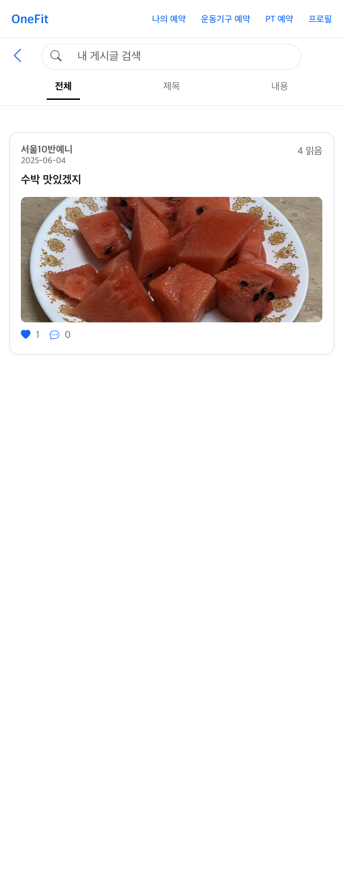

# 🏋️‍♀️ OneFit\_SSAFIT

**SSAFY 1학기 관통 프로젝트**
원하는 날짜와 시간에 운동기구 또는 PT를 예약할 수 있는 모바일 웹 서비스

---

## 📋 Contents

1. [📆 개발 기간](#개발-기간)
2. [👩‍💻 팀원-및-담당-파트](#팀원-및-담당-파트)
3. [🧩 주요-기능](#주요-기능)
4. [💻 서비스-화면](#서비스-화면)
5. [▶️ 실행-방법](#실행-방법)
6. [🛠️ 기술-스택-및-협업-툴](#기술-스택-및-협업-툴)
7. [📐 시스템-아키텍처](#시스템-아키텍처)
8. [🗄️ ERD](#erd)
9. [📅 일정](#일정)
10. [📡 API-명세서](#api-명세서)
11. [🪰 협업-툴](#협업-툴)

---

## 📆 개발 기간

* **2025.04.22 \~ 2025.05.27 (36일)**

---

## 👩‍💻 팀원 및 담당 파트

### 석예은 (팀장/BE & FE)

* Spring Security 및 JWT 기반 로그인/회원가입 구현
* AWS EC2 + RDS를 활용한 백업 서버 및 DB 배포
* S3를 활용한 프로필 사진 업로드 및 프로필 수정 구현
* 헬스장, 트레이너, 운동기구 검색 기능 구현
* 운동기구 예약 전체 구현
* PT/운동기구 확인과 통합구조 "내 예약" 구현

---

## 🧩 주요 기능

### 🔐 회원가입 / 로그인 / 탈퇴

* 사용자는 아이디가 번호를 입력하여 계정을 생성할 수 있습니다.
* 로그인을 통해 서비스에 접근할 수 있습니다.
* 자신의 계정을 삭제하고 회원 탈퇴도 가능합니다.

### ⚙️ 회원 정보 수정

* 전화 번호 및 이메일, 이름을 수정할 수 있습니다.
* 헬스장 및 트레이너 정보를 업데이트할 수 있습니다.
* 프로필 사진 업로드 기능 제공

### 👤 PT 예약

* 회원은 지정된 트레이너에게 PT 예약을 할 수 있습니다.

### 🏋️️ 운동기구 검색 & 필터

* 사용자는 사진 및 설명을 통해 기구 정보를 확인할 수 있습니다.
* 제품명, 운동 부위 기준의 검색 기능 제공
* 카테고리 기능을 통해 운동기구 필터링 가능

### ⏱️ 운동기구 예약 & 확인

* 기구 별 시간대 확인 가능
* 특정 시간에 특정 기구 예약 가능
* 자신이 예약한 기구 예약 목록 확인 가능

### 📜 게시판

* 사용자는 기존 게시물을 조회하고 키워드 기능으로 검색가능
* 게시물 작성, 조회, 수정, 삭제 가능
* 게시물 좋아요 및 댓글 기능

---

## 💻 서비스 화면

#### 회원가입 및 로그인 페이지

<table>
  <tr>
    <td></td>
    <td></td>
    <td></td>
    <td></td>
    <td></td>
  </tr>
</table>

▲ 회원가입 페이지: 1단계-개인정보 입력, 2단계-헬스장 선택, 3단계-트레이너 선택, 회원가입 축하 페이지, 로그인 페이지

#### 메인 페이지

 
▲ 메인페이지: 게시판을 인기순과 최신순으로 조회

#### 게시판 

<table>
  <tr>
    <td></td>
    <td></td>
    <td></td>
    <td></td>
  </tr>
</table>
▲ 게시판 상세조회, 검색, 내 글 검색, 게시글 작성 페이지

#### 운동기구 예약 페이지
<table>
  <tr>
    <td></td>
    <td></td>
    <td></td>
  </tr>
</table>
▲ 운동기구 예약 페이지: 1단계-날짜 선택, 2단계-운동기구 선택, 3단계-시간 선택

#### PT 예약 페이지

 
▲ PT 예약 페이지: 트레이너는 회원정보에서 가져옴. 날짜와 시간만 선택

#### 나의 예약 페이지

 
▲ 나의 예약 페이지: 날짜별 운동기구 예약과 PT 예약 목록을 통합 조회. 예약 취소 가능

#### 프로필
<table>
  <tr>
    <td></td>
    <td></td>
    <td></td>
  </tr>
  <tr>
    <td></td>
    <td></td>
    <td></td>
  </tr>
</table>
▲ 프로필 페이지: 프로필 조회, 프로필 수정(프로필 사진, 이름, 이메일, 헬스장, 트레이너), 비밀번호 변경 페이지

---

## 🛠️ 기술 스택 및 협업 도구

### 💻 Backend

### 🌐 Frontend

### ☁️ Infrastructure & DevOps

### 🛠 협업 도구

---

## 📐 시스템 아키텍처

---

## 🗄️ ERD

---

## 일정

---

## API 명세서

